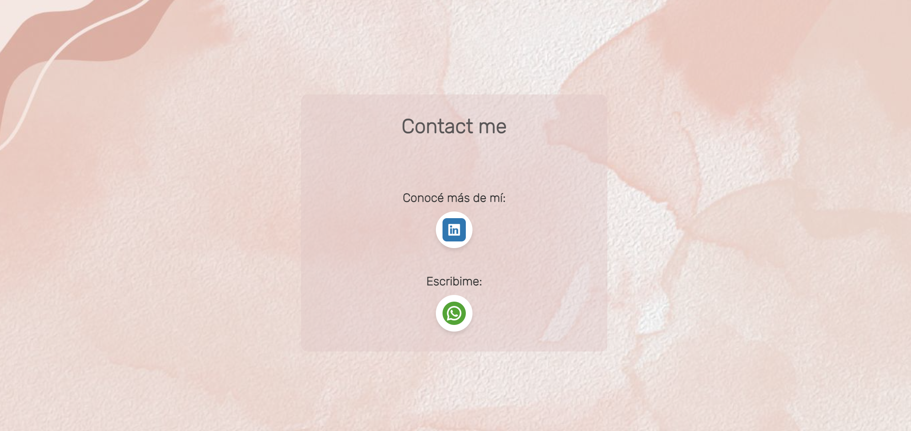

# ✨ Maki Web Project

This is an informative website, my first project built for learning purposes and developed for a client. It was created using HTML, a Bootstrap template, and JavaScript.

* Content Creation

# 🚀 Features

* Responsive Design-Adapts to different screen sizes using Bootstrap.
* Modern UI – Clean and professional design based on Start Bootstrap.
* Google Fonts Integration – Uses the "Rubik" font from Google Fonts.
* Dynamic Elements – Includes JavaScript interactions to enhance user experience.
* I have worked on look and feel of the website
* Hambuguer menu

*  Bilingual webpage

* LinkedIn Maki's Profile redirection
* Whatsapp API conection 

# 🛠️ Technologies Used

* HTML5
* CSS3 & Bootstrap
* JavaScript

# 📖 About

* This project is based on the Start Bootstrap template, created by David Miller, and built on the Bootstrap framework developed by Mark Otto and Jacob Thorton..

* The "Rubik" font from Google Fonts was used for typography: Google Fonts - Rubik "https://fonts.googleapis.com/css2?family=Rubik:wght@300;700&display=swap"

# 💡 How to Use

1. Clone the repository:
git clone https://github.com/LauEroles/Maki-Web-Project.git

2. Open index.html in a browser.

# 📝 To-Do (Future Improvements) 

* Add animations and transitions.
* Creattion of a Blog section
* Improve accessibility features.
* Enhance SEO optimization.